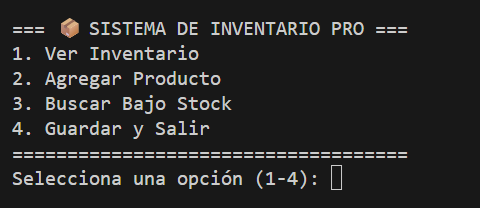

# 📦 Sistema de Inventario Pro (CLI)

Este es un sistema de gestión de inventario desarrollado en Python que utiliza una interfaz de línea de comandos (CLI). Permite administrar productos, controlar el stock y persistir los datos de forma local.

## 🚀 Características
- **CRUD de Productos:** Añadir, visualizar y gestionar stock.
- **Persistencia de Datos:** Los datos se guardan automáticamente en un archivo `productos.json`.
- **Validación de Entradas:** Manejo de errores para evitar fallos si el usuario ingresa datos incorrectos.
- **Alertas de Stock:** Función específica para detectar productos con bajo inventario.

## 🛠️ Tecnologías Utilizadas
- **Python 3.x**
- **JSON:** Para el almacenamiento de datos.
- **OS Module:** Para la gestión de rutas y limpieza de terminal.

## 📂 Estructura del Proyecto
- `main.py`: Punto de entrada y gestión del menú interactivo.
- `funciones.py`: Lógica de negocio y procesamiento de datos.
- `datos.py`: Capa de persistencia (Lectura/Escritura de JSON).
- `productos.json`: Base de datos local en formato de texto.

## ⚙️ Instalación y Ejecución
1. Clona este repositorio o descarga los archivos.
2. Abre una terminal en la carpeta del proyecto.
3. Ejecuta el programa con el siguiente comando:
   ```bash
   python main.py



*"Desarrollado por Inosencio Pérez
